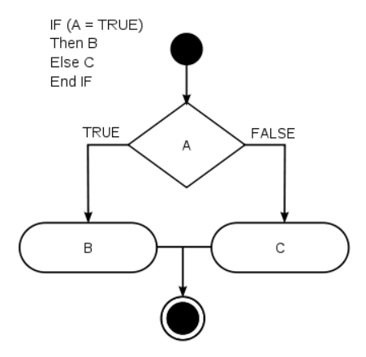
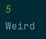
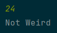

# 🧑‍💻 HackerRank 2

---

In this challenge, we test your knowledge of using if-else conditional statements to automate decision-making processes. An if-else statement has the following logical flow:



##### Task

Given an integer, `n` , perform the following conditional actions:
- If `n` is odd, print `Weird`
- If `n` is even and in the inclusive range of `2` to `5`, print `Not Weird`
- If `n` is even and in the inclusive range of `6` to `20`, print `Weird`
- If `n` is even and greater than `20`, print `Not Weird`

Complete the stub code provided in your editor to print whether or not `n` is weird.

##### Input Format

A single line containing a positive integer, `n`.

##### Constraints

- 1<=n<=10

##### Output Format

Print `Weird` if the number is weird; otherwise, print `Not Weird`.

##### Sample Input O

```txt
3
```

##### Sample Output 0

```txt
Weird
```

##### Sample Input 1

```txt
24
```

##### Sample Output 1

```txt
Not Weird
```

##### Explanation

Sample Case 0: `n = 3`
`n` is odd and odd numbers are weird, so we print Weird.

Sample Case 1: `n = 24`
`n > 20` and `n` is even, so it isn't weird. Thus, we print Not Weird.

---

<details>
<summary>✅ My screen output.</summary>
    
    
</details>

[<--](../ReadMe.md)