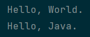

# 🧑‍💻 HackerRank 1

---

Welcome to the world of Java! In this challenge, we practice printing to stdout.

The code stubs in your editor declare a Solution class and a main method. Complete the main method by copying the two lines of code below and pasting them inside the body of your main method.

```java
System.out.println("Hello, World.");
System.out.println("Hello, Java.");
```

##### Input Format

There is no input for this challenge.

##### Output Format

You must print two lines of output:
1. Print `Hello, World.` on the first line.
2. Print `Hello, Java.` on the second line.

##### Sample Output

```txt
Hello, World.
Hello, Java.
```

---

<details>
<summary>✅ My screen output.</summary>
    
</details>

[<--](../ReadMe.md)